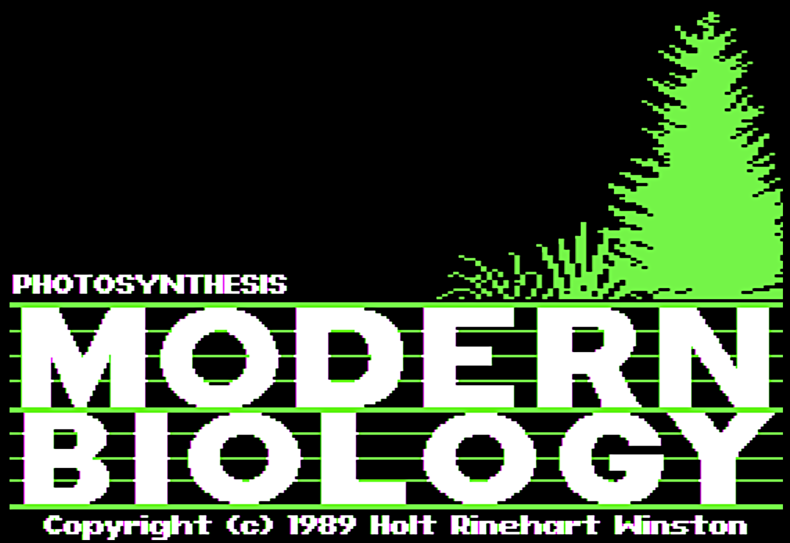
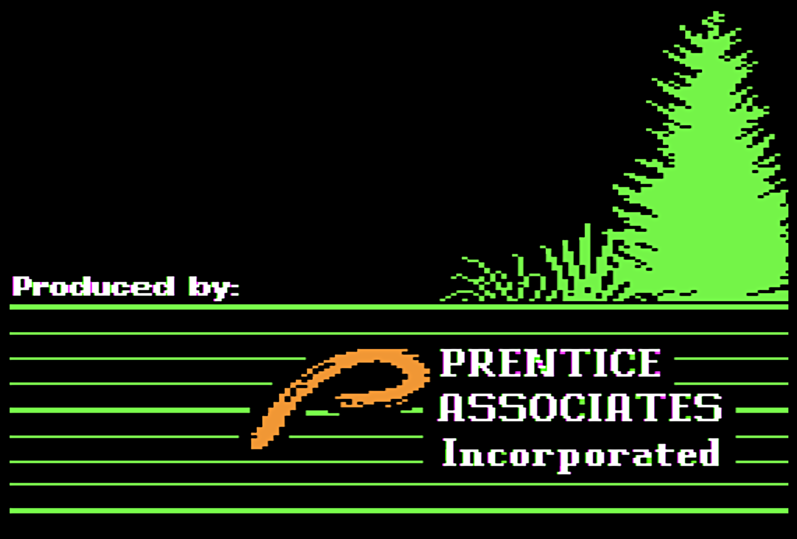
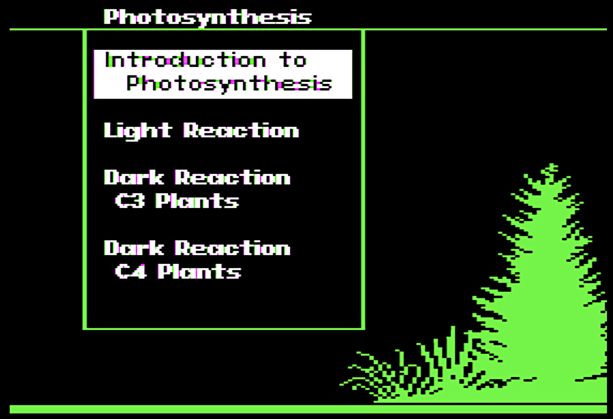

# AppleII-photosynthesis
Apple II source code, in the Forth language, for a commercial photosynthesis educational program

This is the source code for Modern Biology: Photosynthesis, a program for the Apple II computer released by Holt Rinehart Winston. The source was released with the MIT license in 2021 by Lloyd Prentice, the president of Prentice Associates, Inc., the company that produced the software.

